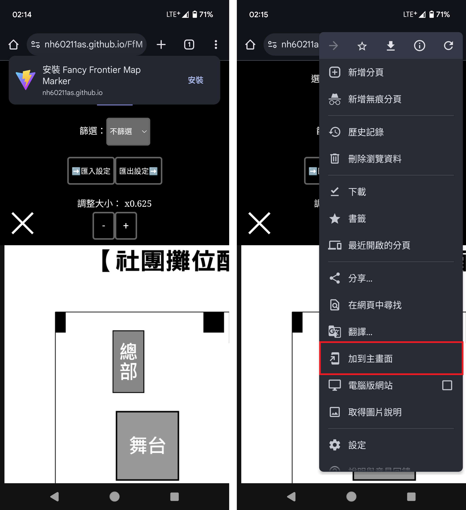
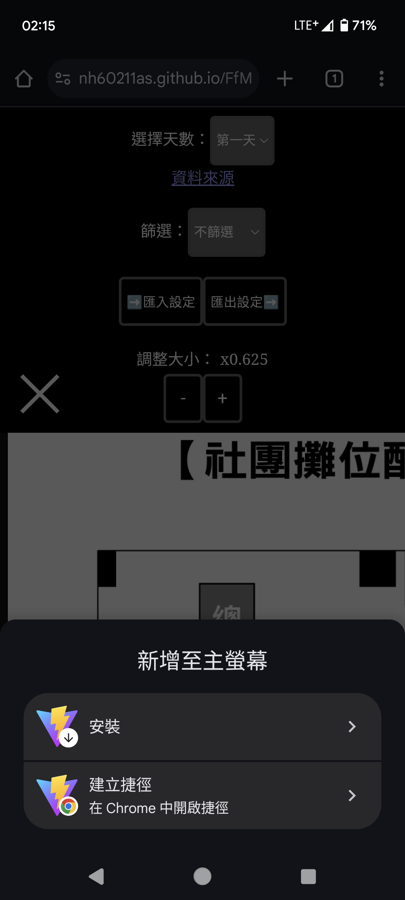

# 安裝說明

以下步驟可以將此網頁安裝在 Android 裝置上並且以 PWA ([Progress Web App](https://zh.wikipedia.org/zh-tw/%E6%B8%90%E8%BF%9B%E5%BC%8F%E7%BD%91%E7%BB%9C%E5%BA%94%E7%94%A8%E7%A8%8B%E5%BA%8F)) 的形式離線執行

1. 使用 Chrome 開啟網頁

   網頁：https://nh60211as.github.io/DoujinMapMarker/

2. 安裝程式 (尋找安裝)
   通常會直接跳出安裝提示，或是開啟瀏覽器選單並且點擊`加到主畫面`
   

1. 安裝程式 (新增置主螢幕)
   接著按下安裝後即可讓此程式以應用程式的形式執行，不需要隨時連上網路皆可使用
   
   